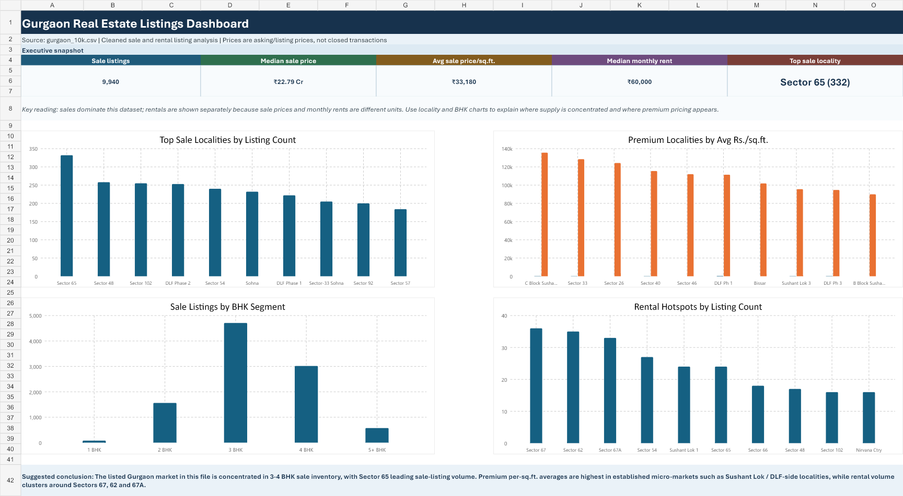

# Gurgaon Real Estate Listings Dashboard

Portfolio-ready Excel dashboard for exploring Gurgaon real estate listing trends across sale and rental inventory.

## Project Summary

This project analyzes a cleaned Gurgaon real estate listing dataset and presents the results in an executive-style Excel dashboard. The workbook is designed to help viewers quickly understand listing volume, sale price levels, rental patterns, and locality-level market concentration.

## Business Question

How can Gurgaon real estate listing data be summarized so that a viewer can quickly understand market activity, price levels, rental demand, and high-volume localities?

## Key Insights

- Sale inventory dominates the dataset, with 9,940 sale listings represented in the dashboard.
- The median sale listing price is approximately INR 2.28 crore.
- The average sale price per sq.ft. is approximately INR 33,180.
- The median monthly rent is INR 60,000.
- Sector 65 has the highest sale listing volume in this dataset.
- Premium pricing appears around established Gurgaon micro-markets, while rental activity clusters around sectors such as 67, 62, and 67A.

## Deliverables

- `gurgaon_real_estate_dashboard.xlsx` - final Excel dashboard workbook.
- `dashboard_preview.png` - dashboard screenshot for quick review.
- `analysis_preview.png` - analysis table preview.
- `clean_data_preview.png` - cleaned data preview.
- `data_dictionary_preview.png` - data dictionary preview.
- `presenter_guide_preview.png` - presentation guide preview.

## Workbook Structure

The workbook contains five sheets:

- `Dashboard` - executive overview with KPIs and visual analysis.
- `Analysis_Tables` - summarized metrics used by the dashboard.
- `Clean_Data` - cleaned listing-level dataset used for analysis.
- `Data_Dictionary` - field definitions and interpretation notes.
- `Presenter_Guide` - talking points for presenting the findings.

## Skills Demonstrated

- Excel dashboard design
- Data cleaning and structuring
- KPI development
- Real estate market analysis
- Pivot-style summary analysis
- Business storytelling with data
- Presentation-ready reporting

## How to View

Download `gurgaon_real_estate_dashboard.xlsx` and open it in Microsoft Excel. Start with the `Dashboard` sheet, then review the analysis and clean data sheets for supporting detail.

## Notes

Prices are listing or asking prices from the source dataset, not confirmed closed transaction prices. Sale prices and monthly rents are analyzed separately because they use different units.
